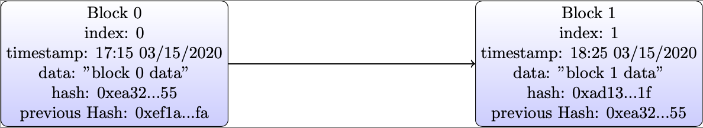

# SuccinctBlockchain
Create a succinct blockchain,  simple, modular, and easy using.

# 设计并实现一个带Token的区块链

## 前言

用简单的，模块化的方法实现区块链的核心功能，最终搭建一个个模块化、可插拔的区块链组件。

了解一个技术的发展历史，方法之一就是从0到1实现它，趁着它还不复杂，能看到全貌和细节。

区块链1.0：比特币，区块链2.0：以太坊，区块链3.0： 区块链网络。

除了这个划分之外，这里面还有很多值得深入探讨的问题，有的已经解决，有的没有解决，我们娓娓道来。

## 区块链的价值

支撑区块链的核心是：人们对区块链的信心。

## 设计

### 本质

保存持续增加的有序数据的的分布式数据库。

### 核心问题的抽象

区块链本质上是一个分布式的数据库。如何分解，抽象出模型是价值所在。

- 首先是数据库，实现它需要解决什么问题：
	- 数据的增加和修改：解决方案是增加和修改分离。就是不断记录新的数据，数据结构：链表。（有向无环图DAG）
	- 数据的删除：没有这个功能，因为要保持数据不可篡改。

- 其次是分布式，就是要保持一致性
	- 节点通信
	- 共识算法

- 共识算法本质上是解决三个问题：
  1. Who can propose the next change?
  2. Which set of changes is final?
  3. What happens if someone breaks the rules?

#### 数据库的内容

##### 定义数据块:区块的结构是什么

```
index：区块的递增编号
data：该区块所保存的数据
timestamp：时间戳
hash：通过SHA256算法对该区块进行的签名
previousHash：前一个数据块的hash值，从而将区块串联了起来
```

##### 定义数据块之间的关系

```
1. index++
2. preivious Hash
```




##### 添加数据块

每个节点都可以添加数据块

```
class Block {

    public index: number;
    public hash: string;
    public previousHash: string;
    public timestamp: number;
    public data: string;

    constructor(index: number, hash: string, previousHash: string, timestamp: number, data: string) {
        this.index = index;
        this.previousHash = previousHash;
        this.timestamp = timestamp;
        this.data = data;
        this.hash = hash;
    }
}
```

##### 区块链出块

由共识算法输出（见“核心问题的抽象”小节）

```
共识算法模块的核心功能1：出块
功能：解决问题：Who can propose the next change?
输入：无。
输出：可以添加数据块的节点编号。
实现：PoW ; PoA; PoS; PFT; etc.
```

##### 共识算法模块

1. 核心功能1：出块

```
共识算法模块的核心功能1：出块
功能：解决问题：Who can propose the next change?
输入：无。
输出：可以添加数据块的节点编号。
实现：PoW ; PoA; PoS; PFT; etc.
```

2. 核心功能2：敲定

```
共识算法模块的核心功能2：敲定
功能：解决问题：Which set of changes is final?
输入：每条链的数据。
输出：敲定最终链的编号
实现：PoW的选择原则是：最长合法链。
```

3. 核心功能3: 惩罚

```
共识算法模块的核心功能3：惩罚
功能：解决问题：What happens if someone breaks the rules?
输入：违反规则的节点编号和违反规则的内容
输出：惩罚的代码参数：比如扣除质押token
实现：
```

##### 通信模块
